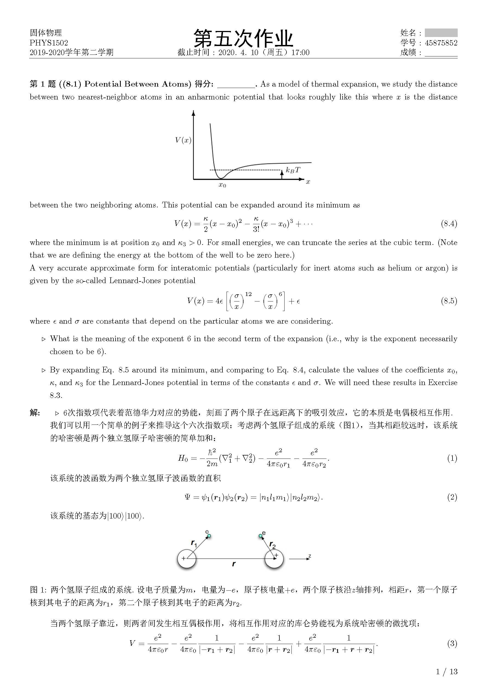
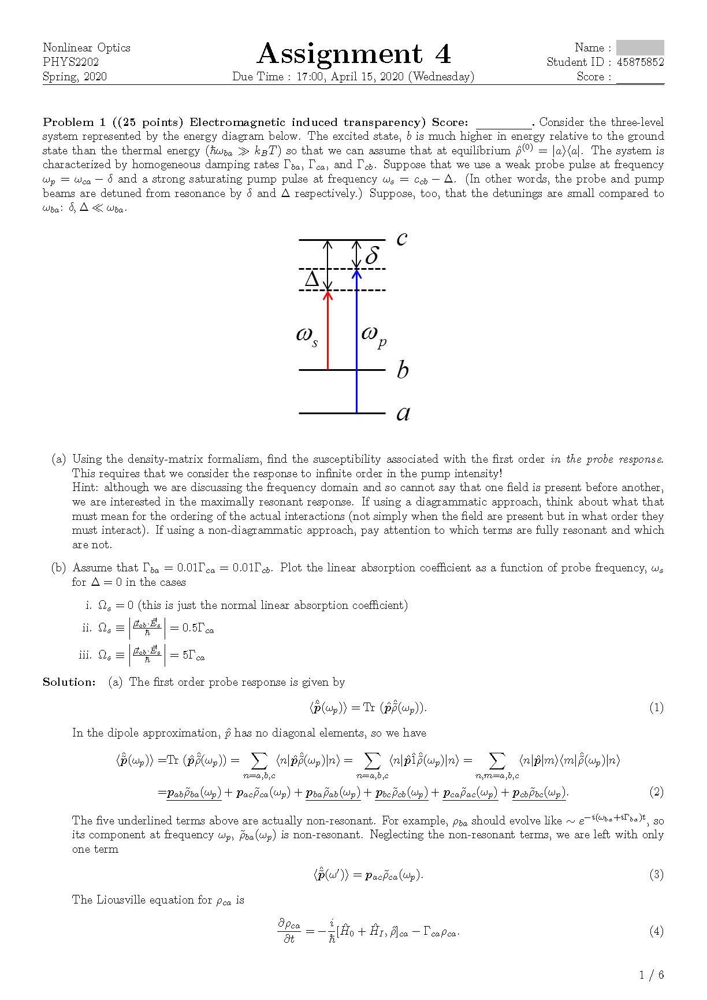

# 作业模板 Assignment Template

可爱而优雅、功能齐全而稳定的\LaTeX模板，适用于
- 作业
- 实验报告
- 课程项目
- 课程论文

等各种场景，支持
- 中英双语
- 数学公式
- 图表
- 化学式
- 程序代码
- 文献引用
等功能.

Cute and elegant, poly-functional and robust LaTeX template, applicable to various scenarios such as
- assignments
- experiment reports
- course projects
- course essays

It is bilingual and supporting functions including
- mathematical formulas
- figures
- tables
- chemistry formulas
- program code
- citing references

同时支持\pdfLaTeX和\XeLaTeX.

Both \pdfLaTeX and \XeLaTeX work.

## 效果展示 Examples

## 注意 Note

文件夹`作业模板(中文版)`和`AssignmentTemplate(En-ver)`是已不再维护的旧版本.

In folder `作业模板(中文版)` and `AssignmentTemplate(En-ver)` are the old version which are not maintained anymore.

## 待做 TODO

暂无.

Null for now.